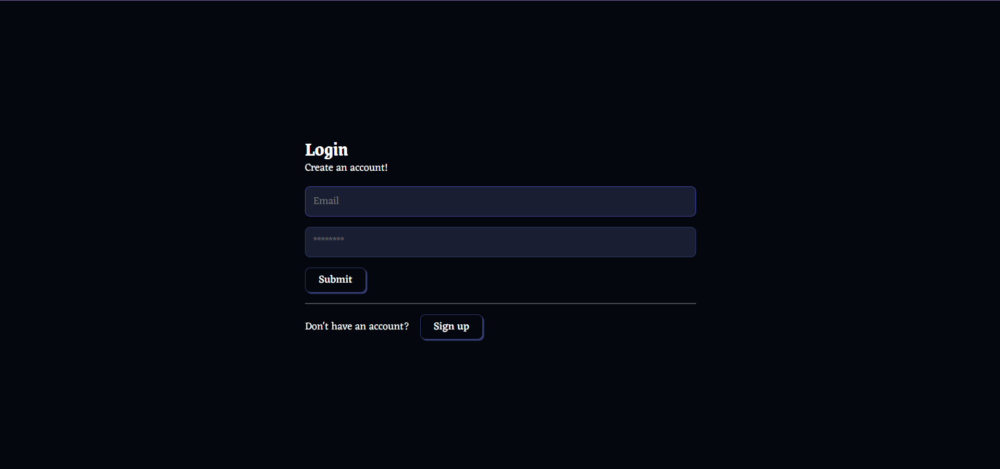
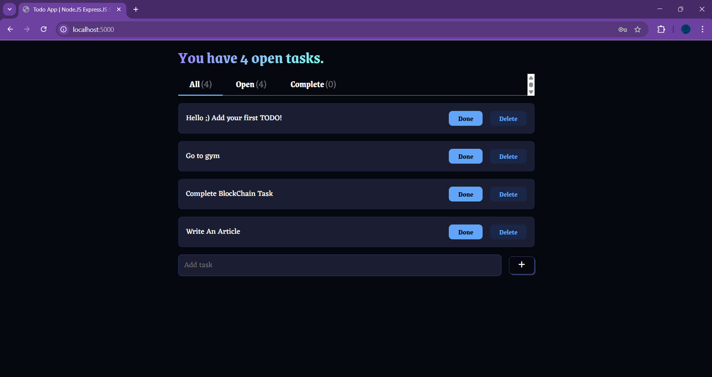
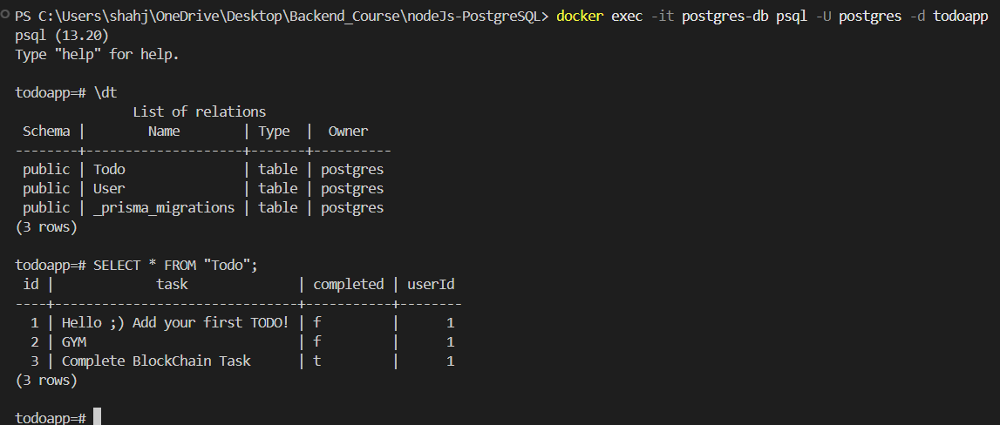

# 📌 Node.js PostgreSQL To-Do App (Dockerized)

A **Dockerized and authentication-protected To-Do App** using **Node.js, Express.js, bcrypt, JWT authentication, Prisma, and PostgreSQL**.

## 🖼️ Project Screenshots

### 📌 **Login Page**



### 📌 **Dashboard**



### 📌 **Database Schema**



---

## 🚀 Overview

This app allows users to:

- **Register:** Create a new account.
- **Login:** Authenticate and receive a JWT token.
- **Manage Todos:** Perform authentication-protected CRUD operations on their own tasks.

## 📁 Project Structure

```
backend-todo-app/
│
├── public/
│   └── index.html              # Frontend HTML file for authentication and todo management
│
├── prisma/
│   ├── schema.prisma           # Database schema definition
│   └── migrations/             # Migration files generated by Prisma
│
├── src/
│   ├── controllers/            # (Optional) For future separation of concerns
│   ├── middlewares/
│   │   └── authMiddleware.js    # Middleware for verifying JWT and protecting routes
│   ├── routes/
│   │   ├── authRoutes.js        # Routes for user registration and login
│   │   ├── todoRoutes.js        # Routes for authenticated CRUD operations on todos
│   ├── prismaClient.js          # Prisma client database setup and table creation
│   ├── server.js                # Main server entry point that sets up routing and middleware
│
├── Dockerfile                   # Docker container setup instructions
├── docker-compose.yaml           # Docker setup config file
├── package.json                  # Project dependencies and scripts
├── package-lock.json             # Lockfile for exact dependency versions
└── todo-app.rest                 # REST client file for emulating API requests
```

## 📌 Explanation of Key Directories and Files

- **prisma/**: Contains Prisma's schema (`schema.prisma`) and migration files.
- **public/**: Contains the frontend HTML file that interacts with the backend API.
- **src/**: Core backend code.
  - **controllers/** (optional): Organizes logic separately from routes.
  - **middlewares/**: Middleware for handling JWT authentication.
  - **routes/**: API routes for authentication and CRUD operations.
  - **prismaClient.js**: Sets up Prisma client for database interaction.
  - **server.js**: Configures Express.js application, routes, and middleware.
- **.env**: Stores environment variables like `DATABASE_URL` and `JWT_SECRET`.
- **Dockerfile**: Builds the Node.js app in a containerized environment.
- **docker-compose.yaml**: Sets up both Node.js and PostgreSQL in Docker.
- **package.json**: Defines Node.js dependencies and scripts.
- **README.md**: This documentation.

---

## 🚀 Getting Started

### 1️⃣ Install Docker Desktop

### 2️⃣ Clone the Repository:

```sh
git clone https://github.com/Arbiter09/dockerized-nodejs-postgresql-todo.git
cd backend-todo-app
```

### 3️⃣ Generate the Prisma Client:

```sh
npx prisma generate
```

### 4️⃣ Build Docker Images:

```sh
docker compose build
```

### 5️⃣ Create PostgreSQL Migrations and Apply Them:

```sh
docker compose run app npx prisma migrate dev --name init
```

To apply migrations if necessary:

```sh
docker-compose run app npx prisma migrate deploy
```

### 6️⃣ Boot Up Docker Containers:

```sh
docker compose up
```

Or run in detached mode:

```sh
docker compose up -d
```

### 7️⃣ Access PostgreSQL Database (inside Docker container):

```sh
docker exec -it postgres-db psql -U postgres -d todoapp
```

### 8️⃣ Stop Docker Containers:

```sh
docker compose down
```

### 9️⃣ Delete All Docker Containers:

```sh
docker system prune
```

### 🔗 Access the App:

Open **http://localhost:5003** (or `localhost:3000` if changed) in your browser to see the frontend. You can **register, log in, and manage your todos**.

---

## 📌 Emulating HTTP Requests (REST Client)

The `todo-app.rest` file helps you test the API using HTTP requests directly. You can use VS Code’s REST Client extension or Postman.

### 📝 Provided Requests:

- **Register a user** (POST `/auth/signup`)
- **Login** (POST `/auth/login`)
- **Fetch todos** (GET `/todos`)
- **Add a todo** (POST `/todos`)
- **Update a todo** (PUT `/todos/:id`)
- **Delete a todo** (DELETE `/todos/:id`)

### 🚀 How to Use:

1. Install **REST Client** extension in VS Code.
2. Open `todo-app.rest`.
3. Run the requests by clicking "Send Request" above each block.
4. For protected routes, copy the **JWT token** from the login response and replace `{{token}}` in requests.

---

## 📜 Conclusion

This guide covers:
✅ **Project Setup with Docker**  
✅ **Authentication with JWT**  
✅ **CRUD Operations on Todos**  
✅ **Using Prisma for Database Management**  
✅ **Testing with REST Client**

🎯 Now, you can explore the app’s functionality and start building upon it! 🚀
